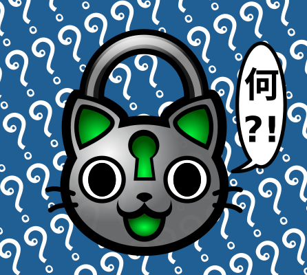
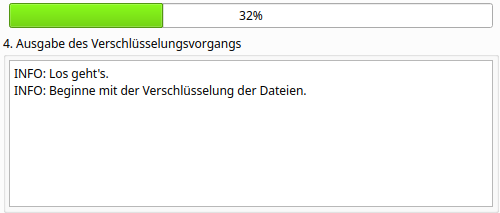
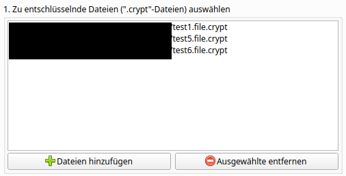

Lokkat: Bedienunganleitung

{TOC}

#1 Was ist Lokkat?
Lokkat ist eine Software zur Ver- und Entschlüsselung von Dateien. Der hierfür genutzte Verschlüsselungsalgorithmus ist das sogenannte ["One-Time-Pad"-Verfahren](https://de.wikipedia.org/wiki/One-Time-Pad). Dieses bietet die Möglichkeit [perfekte Sicherheit](https://de.wikipedia.org/wiki/Perfekte_Sicherheit) für die verschlüsselten Dateien zu erreichen. Lokkat ist [freie Software](https://de.wikipedia.org/wiki/Freie_Software).

Lokkat hat hauptsächlich zwei Verwendungsweisen: Verschlüsselung und Entschlüsselung.

##1.1 Wie verschlüssele ich Dateien?
Auf dem Reiter "Verschlüsselung" in der Benutzoberfläche gibt es vier durchnummerierte Schritte. Der erste dieser Schritte ist die Auswahl von Dateien, die verschlüsselt werden sollen. 

###1.1.1 Auswahl der "Klartextdateien"
Diese Dateien werden in einer Listenansicht dargestellt. Um dieser Listenansicht Dateien hinzuzufügen oder wieder zu entfernen, befinden sich unterhalb der Listenansicht zwei Schaltflächen.

###1.1.2 Auswahl der Zufallsdatenquelle
Nachdem alle zu verschlüsselnden Dateien ausgewählt und der Listenansicht hinzugefügt wurden, muss ausgewählt werden, welche Quelle für die Zufallsdaten verwendet werden soll. Zufallsdaten werden für die Verschlüsselung benötigt.

Es gibt zwei Auswahlmöglichkeiten:

- **Physikalischer Zufall aus Quantenfluktuation**: diese Option sorgt dafür, dass die für die Verschlüsselung verwendeten Zufallsdaten von den Servern der Australian National University stammen. Die ANU verwendet [Quantenfluktuation im Vakuum](https://qrng.anu.edu.au/) für diese Zufallsdaten. Für perfekte Sicherheit werden Zufallsdaten aus physikalischen Vorgängen benötigt. Da diese ohne spezielles Equipment auf den meisten Computern nicht ausreichender Menge generiert werden können, besteht die Möglichkeit die Dienste der ANU zu nutzen. Die maximale Datengröße (kombiniert aus den einzelnen Dateigrößen der zu verschlüsselnden Dateien) darf 1 Mibibyte (1024* 1024 Byte) nicht überschreiten. Der Grund für dieses Limit ist, dass die ANU ihre Dienste und Bandbreite der Allgemeinheit kostenfrei bereitstellt und wir diese Großzügigkeit nicht ausnutzen möchten.

- **Systemeigener CSPRNG**: diese Option nutzt den systemeigenen [kryptografisch sicheren Pseudo-Zufallszahlengenerator](https://de.wikipedia.org/wiki/Kryptographisch_sicherer_Zufallszahlengenerator). Je nach verwendetem Betriebssystem (und dessen Einstellung) sorgt dies für mehr oder weniger sichere Pseudozufallsdaten.

*Anmerkung: Im Abschnitt [Wie sicher ist Lokkat?] wird näher auf die Sicherheit der Verschlüsselung eingegangen.*

###1.1.3 Starten des Verschlüsselungsvorgangs

Der Verschlüsselungsvorgang wird durch das Klicken der entsprechenden Schaltfläche gestartet. Die Schaltfläche verschwindet anschließend und wird durch einen Fortschrittsbalken ersetzt, die den Fortschritt der Verschlüsselungsoperation darstellt. Nach Abschluss der Operation erscheint die ursprüngliche Schaltfläche wieder.

###1.1.4 Ausgabe des Verschlüsselungsvorgangs

Unterhalb der Schaltfläche befindet sich eine Ausgabefläche für Text. Hier werden Meldungen über den Fortschritt des Verschlüsselungsvorgangs angezeigt. Ob der Vorgang erfolgreich abgeschlossen werden konnte oder nicht, kann diesen Meldungen entnommen werden.

##1.2 Wie entschlüssele ich meine Dateien wieder?
Auf dem Reiter "Entschlüsselung" in der Benutzoberfläche gibt es drei durchnummerierte Schritte. Der erste dieser Schritte ist die Auswahl von Dateien, die entschlüsselt werden sollen. 

###1.2.1 Auswahl der verschlüsselten Dateien (Dateiendung: .crypt)
Diese Dateien werden in einer Listenansicht dargestellt. Um dieser Listenansicht Dateien hinzuzufügen oder wieder zu entfernen, befinden sich unterhalb der Listenansicht zwei Schaltflächen.

**HINWEIS:** *Damit die Dateien erfolgreich wieder entschlüsselt werden können, müssen sich die zugehörigen Schlüsseldateien (Dateiendung: `.otp`) in den jeweils gleichen Verzeichnissen befinden. Ein Beispiel wäre: um die Datei `geheim.txt.crypt` wieder zu entschlüsseln, muss sich im selben Verzeichnis die Schlüsseldatei `geheim.txt.otp` befinden.*

###1.2.2 Starten des Entschlüsselungsvorgangs

Der Entschlüsselungsvorgang wird durch das Klicken der entsprechenden Schaltfläche gestartet. Die Schaltfläche verschwindet anschließend und wird durch einen Fortschrittsbalken ersetzt, die den Fortschritt der Entschlüsselungsoperation darstellt. Nach Abschluss der Operation erscheint die ursprüngliche Schaltfläche wieder.

###1.2.3 Ausgabe des Entschlüsselungsvorgangs

Unterhalb der Schaltfläche befindet sich eine Ausgabefläche für Text. Hier werden Meldungen über den Fortschritt des Entschlüsselungsvorgangs angezeigt. Ob der Vorgang erfolgreich abgeschlossen werden konnte oder nicht, kann diesen Meldungen entnommen werden.

#2 Wie sicher ist Lokkat?
Die kurze Antwort lautet: *ziemlich bis sehr sicher*.

Die lange wäre dann- das hängt der Verwendung und den Umgebungsfaktoren ab:

##2.1 Verifikation von Downloads
Wenn du deinen Download von Lokkat mit Hilfe des öffentlichen Schlüssels verifiziert hast, dann kannst du dir ziemlich sicher sein, dass er nicht manipuliert wurde, bevor er auf deinem Rechner landete. Das ist gut- es erhöht die Sicherheit.

##2.2 Nutzung des offenen Quellcodes
Wenn du den Quellcode von Lokkat heruntergeladen hast, statt eine vorkompilierte Version, dann kannst du selbst überprüfen, ob sich Sicherheitslücken oder Hintertüren im Programm befinden, sofern du Python-Quellcode verstehst. Selbst wenn nicht, kannst du annehmen, *dass* jemand der es kann, dies bereits getan hat und hoffen, dass diese Person die Allgemeinheit über mögliche gefundene Schwachstellen informiert, oder besser noch: diese gleich gefixt hat. Diese Möglichkeit besteht bei nicht offen gelegtem Quellcode nicht. Somit ist es gut, dass der Quellcode von Lokkat offen gelegt ist- es erhöht die Sicherheit.

##2.3 Das One-Time-Pad-Verfahren
Da Lokkat das ["One-Time-Pad"-Verfahren](https://de.wikipedia.org/wiki/One-Time-Pad) zur Verschlüsselung von Daten verwendet, ist eine Entschlüsselung durch [Brute-Force-Angriffe](https://de.wikipedia.org/wiki/Brute-Force-Methode#Kryptologie) nicht möglich. Die Schlüssel sind so lang wie die Klartexte. Keine zwei Stellen im Klartext werden mit dem gleichen Teil des Schlüssels verschlüsselt. Das ist sogar sehr gut- es erhöht die Sicherheit ungemein. Es hat allerdings auch den Nachteil, dass die Schlüssel immer genau soviel Speicher schlucken, wie die zu verschlüsselnden Daten. Das bedeutet, dass Daten in ihrem verschlüsselten Zustand immer *doppelt* so viel Platz beanspruchen, wie sie unverschlüsselt bräuchten. Dies ist ein Preis für die erhöhte Sicherheit im Vergleich zu anderen gängigeren Verschlüsselungsverfahren.

##2.4 Nutzung des CSPRNG
Wenn du deine Daten mit Hilfe des [CSPRNG](https://de.wikipedia.org/wiki/Kryptographisch_sicherer_Zufallszahlengenerator) deines Betriebssystems verschlüsselt hast, dann kommt es darauf an, ob du deinem Betriebssystem trauen kannst: Windows und MacOS verfügen über Hintertüren. Die meisten Linux-Distributionen wahrscheinlich nicht. Schlussendlich ist es eine Vertrauensfrage. Gehen wir ein potenzielles Angriffsszenario durch:

1. Du hast deine Daten mit Hilfe des CSPRNG deines Betriebssystems verschlüsselt
2. Du hast die Schlüsseldateien sicher von deinem System entfernt (mehr dazu [später](#2_4)) und bewahrst sie an einem sicheren Ort auf, der für den Angreifer nicht zugänglich ist (bspw. ein USB-Stick in einem nur dir bekannten Schließfach)
3. Der Angreifer hat die verschlüsselten Dateien (Endung: `.crypt`) in die Finger bekommen. Welche Informationen kann er aus ihnen ziehen?
	- er weiß, *wie groß* die Dateien sind
	- er weiß wahrscheinlich. wann sie das letzte Mal geändert wurden
	- er weiß wahrscheinlich, wann sie erstellt wurden
	- es ist gut möglich, dass er weiß, welcher Benutzer sie erstellt hat
	
	- er weiß nicht, was sich in ihnen befindet und es macht keinen Sinn, dass er einen Brute-Force-Angriff startet, um an die Daten zu gelangen, da dieser keine Erfolgschance hat
	- er kann eine Vermutung darüber anstellen, mit welcher Art von Zufallszahlen die Daten verschlüsselt wurden; eine Dateigröße über 1 MiB bedeutet automatisch, dass der CSPRNG verwendet wurde

4. Es gibt nun min. folgende Wege für den Angreifer an die verschlüsselten Daten zu kommen:
	1. Er hatte schon zum Zeitpunkt der Verschlüsselung Zugriff auf das System- das bedeutet, die Klartextdateien standen ihm dann schon zur Verfügung. Das ist natürlich extrem schlecht. Man sollte nach allen bekannten Möglichkeiten sicherstellen, dass das verwendete System nicht kompromittiert ist, wenn man Daten vor fremden Zugriff sichern will.
	2. Er hat sich erst nach dem Verschlüsselungsvorgang Zugang zum System mit den verschlüsselten Daten verschafft. Die Schlüsseldateien wurden jedoch nicht "sicher" gelöscht und Teile von ihnen oder gar die ganzen Schlüssel lassen sich durch Spezialwerkzeuge wiederherstellen. Das ist natürlich schlecht. Wie dieser Fall verhindert werden kann, wird [weiter unten](#2_4) erklärt.
	3. Wie im Fall zuvor hat erst später Zugriff auf das System, hat aber keine Möglichkeit die Schlüsseldateien wiederherzustellen. Das ist gut! Sollte das System allerdings einen zu schwachen CSPRNG verwenden, oder der sich der Zustand des CSPRNG zum Verschlüsselungszeitpunkt rekonstruieren lassen, dann ist das sehr schlecht, weil der Angreifer einfach den CSPRNG mit diesen Parametern erneut starten kann und sich auf diese Weise die Schlüssel rekonstruieren kann.
	4. Androhung oder Einsatz von Gewalt gegen Personen, die über die Schlüssel verfügen

##2.4 "Unsicher" gelöschte Schlüsseldateien
Wenn Dateien üblicherweise gelöscht werden, so werden sie in aller Regel nicht *wirklich* gelöscht. Vielmehr "vergisst" das Betriebssystem, dass sich an jener Stellen auf dem Laufwerk eine Datei befindet und gibt den Platz somit für die Speicherung anderer Dateien frei. Solange allerdings noch keine neuen Dateien an die **gleiche** Stelle geschrieben wurden, bleiben die Bits, aus denen die alte Datei bestand, unangetastet an der gleiche Stelle gespeichert. Nur ein *wiederholtes* Überschreiben dieser Stelle auf dem Laufwerk verhindert eine Rekonstruktion nahezu so zuverlässig, wie die physische Zerstörung des Laufwerks.
Es gibt Werkzeuge, um Dateien auf diese Weise sicher zu löschen und sich nicht darauf verlassen zu müssen, dass die Spuren gelöschter Dateien mit andauernder Nutzung des Systems langsam verblassen. Lokkat bietet momentan noch keine eingebaute Möglichkeit vor diesem Risiko zu schützen. Eine zukünftige Version könnte die Möglichkeit bieten, dass Schlüsseldateien sofort auf ein separates Laufwerk, wie bspw. einen USB-Stick geschrieben werden könnten, so dass sie bspw. nie auf der Festplatte des verwendeten Computers landen und somit auch keine Rückstände auf ihr hinterlassen können.

##2.5 "Echter" Zufall
Aber wie steht es mit "echtem" physikalischem Zufall? Schließlich gilt: das One-Time-Pad-Verfahren erlaubt perfekte Sicherheit, wenn es nur mit hinreichend "zufälligem" Zufall genutzt wird. Und was wäre eine bessere Quelle für Zufall, als physikalische Phänomene, die sich unserem Verständnis für Vorhersagbarkeit entziehen und sich aller Wahrscheinlichkeit nach vollkommen chaotisch verhalten?

Gute Frage. Wahrscheinlich nichts. Wenn wir in einer deterministischen Welt leben sollten, dann gibt es so etwas wie Zufall natürlich nicht. [Das scheint allerdings nicht der Fall zu sein.](https://de.wikipedia.org/wiki/Indeterminismus#Objektiver_Zufall)

Ohne das entsprechende Equipment allerdings an Zufallsdaten aus Quellen wie radioaktivem Zerfall, Atmosphärenrauschen oder Quantenfluktuation im Vakuum zu kommen - und das in ausreichenden Mengen - ist schwierig. Daher nutzt Lokkat derzeit die Dienste der Australian National University.

##2.6 Zufall aus dem "kochenden" Vakuum
Die Australian National University stellt über ihre Webseite [https://qrng.anu.edu.au/](https://qrng.anu.edu.au/) Zufallsdaten aus einem ihrer Experimente zur Verfügung. Das ganze ist kostenlos, vielversprechend, bietet jedoch auch eigene Risiken.

- Diese Zufallsdatenquelle könnte ein Fake sein. In diesem Fall wären dem Anbieter dieser Fake-Datenquelle alle versendeten Zufallsdaten (sowie wahrscheinlich auch ihre Empfänger-IP-Adressen) bekannt und würden in einer Datenbank angespeichert werden, damit sie später dazu verwendet werden könnten, um potenzielle Geheimnisse und Verschlüsselungen zu brechen. Sehr unwahrscheinlich, aber nicht komplett auszuschließen.

- Die sichere Kommunikation mit der ANU könnte kompromittiert sein. Jemand könnte sich als die ANU ausgeben oder die Kommunikation abhören und protokollieren. Die Kommunikation mit der ANU ist über TLS gesichert (wenn auch nur Version 1.0). Das ist nicht optimal, da TLS 1.0 von vielen [nicht mehr als sicher genug angesehen wird](https://en.wikipedia.org/wiki/Transport_Layer_Security#TLS_1.0).
Da TLS ein Verschlüsselungsverfahren ist, das schlussendlich darauf vertraut, dass ein geheimer Schlüssel [hinreichend schwierig zu erraten ist](https://en.wikipedia.org/wiki/Public-key_cryptography), so ist mittels TLS verschlüsselte Kommunikation natürlich nicht *ewig* sicher. Sollte jemand die Nachricht in verschlüsseltem Zustand mitlesen (so wie es beispielsweise Internetanbieter oder im Grunde genommen jede Station zwischen dir und der ANU kann, so wird es irgendwann in der Zukunft möglich sein, diese Nachricht zu knacken. Die Frage ist halt nur: [wann?](https://en.wikipedia.org/wiki/Public-key_cryptography#Weaknesses)
Für viele Einsatzgebiete von TLS, wie bspw. die sichere Kommunikation beim Online Banking ist dies ausreichend. Für unseren Fall des Einsatzes von One-Time-Pad-Kryptographie, einer Verschlüsselungsmethode mit deren Einsatz die meisten Anwender dieses Programms eh "mit Kanonen auf Spatzen" schießen werden, besteht allerdings die besondere Situation, dass der Anwender ja vielleicht **wirklich** und mit **möglichst absoluter Sicherheit** will, dass die verschlüsselten Daten **auf ewig** sicher sind, solange man nicht über die richten Schlüssel verfügt.

##2.7 PERFEKTE SICHERHEIT?
Du siehst also, dass hauptsächlich Umgebungsfaktoren, wie das verwendete Betriebssystem, dessen CSPRNG, das unsichere Löschen von Dateien, sowie nicht zu vergessen: *der Faktor Mensch* die effektive Sicherheit der Verschlüsselung mit Lokkat verringern können. Auch wenn das natürlich nicht schön ist, so ist es **dennoch** gut, da sich die meisten dieser Risiken umgehen lassen, um die effektive Sicherheit zu steigern.

Dem vorhin genannten Anspruch an perfekte und ewige Sicherheit kann Lokkat derzeit allerdings (noch!) nicht gerecht werden. Auch wenn alle äußeren Faktoren, wie unsichere Verwendung, unsichere Betriebssysteme usw. ausgeschlossen wurden, so ist die beste Quelle für "echten" Zufall bisher der Server der ANU- und TLS kann nun einmal früher oder später geknackt werden. Sollte die Kommunikation also aufgezeichnet worden sein, so wird es irgendwann möglich sein, sie zu überwinden und herauszufinden, welche Zufallsdaten verschickt wurden.

Aber es gibt Hoffnung. Eine zukünftige Version könnte die Möglichkeit beinhalten "echten" Zufall aus *eigenen* Quellen, wie bspw. geeigneten Sensoren zu nutzen. Kombiniert mit allen anderen Vorsichtsmaßnahmen wäre dies das letzte Puzzleteil, um die durch das OTP-Verfahren ermöglichte, **PERFEKTE** Sicherheit zu erreichen.

Somit muss - um der Wahrheit zu entsprechen - gesagt sein, dass Lokkat keine perfekte Verschlüsselung bieten kann. Aber wir sind schon verdammt nah dran- deutlich näher, als nahezu alle anderen zumindest. Das hat seinen [Preis](https://de.wikipedia.org/wiki/One-Time-Pad#Nachteile), aber für viele Anwendungsfälle kann dies immer noch die beste Lösung sein.
